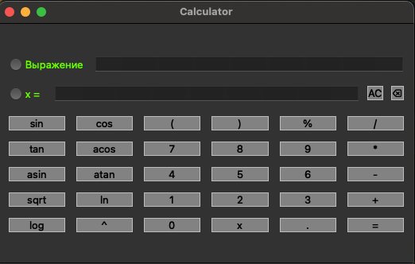
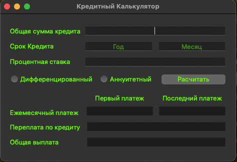

# SmartCalc

Реализация SmartCalc на С++

## Содержание

0. [Введение](#введение)
1. [Информация](#информация)
2. [Реализация](#реализация) 
3. [Кредитный калькулятор](#кредитный-калькулятор)

## Введение

В данном проекте мне предстояло реализовать на языке программирования С++ с использованием структурного подхода расширенную версию обычного калькулятора. Помимо базовых арифметических операций, как плюс-минус и умножить-поделить, я дополнил калькулятор возможностью вычисления арифметических выражений с учетом приоритетов, а так же некоторыми математическими функциями (синус, косинус, логарифм и т.д.). Помимо вычисления выражений калькулятор так же поддерживает использование переменной _x_ и построение графика соответствующей функции. В качестве дополнительных улучшений реализован кредитный калькулятор.

Для реализации калькулятора использовал *алгоритм Дейкстры* для перевода выражений в *обратную польскую нотацию*.

## Реализация

- Программа разработана на языке C++ стандарта C++17
- При написании кода придерживался Google Style
- Покрытие unit-тестами модулей, связанных с вычислением выражений, c помощью библиотеки GTest
- Сборка программы настроена с помощью Makefile со стандартным набором целей для GNU-программ: all, install, uninstall, clean, dvi, dist, tests.
- Реализация с графическим пользовательским интерфейсом, на базе GUI-библиотеки Qt.
- Программа реализована с использованием паттерна MVC.
- На вход программы могут подаваться как целые числа, так и вещественные числа, записанные и через точку, и в экспоненциальной форме записи
- Вычисление производится после полного ввода вычисляемого выражения и нажатия на символ `=`
- Вычисление произвольных скобочных арифметических выражений в инфиксной нотации
- Вычисление произвольных скобочных арифметических выражений в инфиксной нотации с подстановкой значения переменной _x_ в виде числа
- Построение графика функции, заданной с помощью выражения в инфиксной нотации с переменной _x_  (с координатными осями, отметкой используемого масштаба и сеткой с адаптивным шагом)
- Область определения и область значения функций ограничиваются числами от -1000000 до 1000000
- Проверяемая точность дробной части - минимум 7 знаков после запятой
- У пользователя есть возможность ввода до 255 символов
- Скобочные арифметические выражения в инфиксной нотации должны поддерживать следующие арифметические операции и математические функции:
    - **Арифметические операторы**:

        | Название оператора | Инфиксная нотация   (Классическая) | Префиксная нотация   (Польская нотация) |  Постфиксная нотация   (Обратная польская нотация) |
        | ------ | ------ | ------ | ------ |
        | Скобки | (a + b) | (+ a b) | a b + |
        | Сложение | a + b | + a b | a b + |
        | Вычитание | a - b | - a b | a b - |
        | Умножение | a * b | * a b | a b * |
        | Деление | a / b | / a b | a b \ |
        | Возведение в степень | a ^ b | ^ a b | a b ^ |
        | Остаток от деления | a mod b | mod a b | a b mod |
        | Унарный плюс | +a | +a | a+ |
        | Унарный минус | -a | -a | a- |

    - **Функции**:
  
        | Описание функции | Функция |   
        | ---------------- | ------- |  
        | Вычисляет косинус | cos(x) |   
        | Вычисляет синус | sin(x) |  
        | Вычисляет тангенс | tan(x) |  
        | Вычисляет арккосинус | acos(x) | 
        | Вычисляет арксинус | asin(x) | 
        | Вычисляет арктангенс | atan(x) |
        | Вычисляет квадратный корень | sqrt(x) |
        | Вычисляет натуральный логарифм | ln(x) | 
        | Вычисляет десятичный логарифм | log(x) |

## Кредитный калькулятор

Предусмотрен специальный режим "кредитный калькулятор" (за образец взяты сайты banki.ru и calcus.ru):
 - Вход: общая сумма кредита, срок, процентная ставка, тип (аннуитетный, дифференцированный)
 - Выход: ежемесячный платеж, переплата по кредиту, общая выплата
